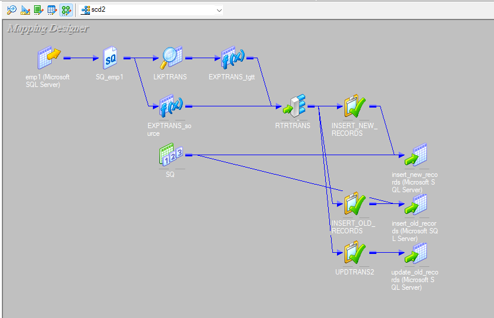
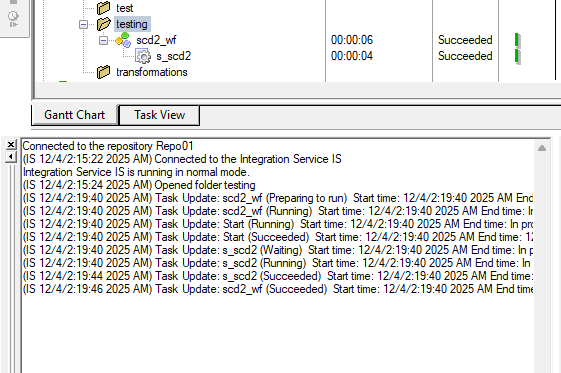
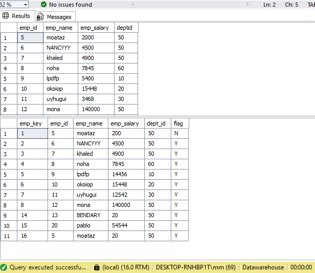

# 📌 SCD Type 2 Implementation in Informatica PowerCenter

## 📝 Overview
This project demonstrates a complete implementation of **Slowly Changing Dimension Type 2 (SCD2)** using **Informatica PowerCenter**.  
The goal is to track historical changes in dimension data while preserving all previous versions of each record.

This repository includes:
- ETL mappings for SCD2
- Lookup & Update Strategy logic
- Sample source and target data
- Workflow to run and validate the SCD2 process

---

## 📚 What is SCD Type 2?
**Slowly Changing Dimensions (SCD)** represent data that changes slowly over time in a data warehouse.

### 🔹 SCD Type 2
SCD Type 2 keeps the **full history** of changes.  
When a change occurs:
1. The old record is **closed** (`End_Date` updated, `Is_Current = 0`)
2. A **new record is inserted** with updated values
3. The new record becomes the **current active version** (`Is_Current = 1`, `Start_Date = current date`)

**Typical SCD2 Columns:**
- Surrogate Key  
- Natural Key  
- Attribute columns  
- Start_Date  
- End_Date  
- Is_Current

 ## 🖼️ Project Screenshots

### 📍 1. SCD2 Mapping (Informatica PowerCenter)

---

### 📍 2. Session 

---

### 📍 3. Output After SCD2 Load

